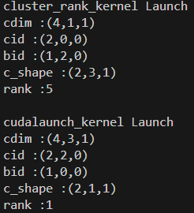
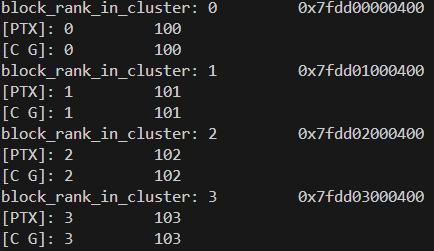

# Hopper SW spec in CUTLASS/CUTE

# cluster launch kernel

## \_\_cluster\_dims\_\_

\_\_cluster\_dims\_\_(2,1,1)表示cluster的维度是（2,1,1），每个cluster中包含两个block。

```c++
__global__ __cluster_dims__(2,1,1)
void kernel(float* ptr){}
```

启动kernel的代码如下，不用额外传入cluster的config参数。

```c++
kernel<<<grid, block>>>(ptr);
```

## cudaLaunchKernelEx

以<<<>>>的方式调用kernel的方式是cuda提供的语法糖，编译后都会去调用runtime中的launchkernel函数。

cuda\_runtime\_api.h中提供了两个launkernel的函数，第一个cudaLaunchKernel中只有gridDim、 blockDim、sharedMem等kernel config，并没有cluster 参数。Hopper架构以后nvidia在grid和block之间新增了cluster层级，新增了cudaLaunchKernelExC的函数来调用使用了cluster的kernel。

```cuda-cpp
#elif defined(__CUDART_API_PER_THREAD_DEFAULT_STREAM)
    // nvcc stubs reference the 'cudaLaunch'/'cudaLaunchKernel' identifier even if it was defined
    // to 'cudaLaunch_ptsz'/'cudaLaunchKernel_ptsz'. Redirect through a static inline function.
    #undef cudaLaunchKernel
    static __inline__ __host__ cudaError_t cudaLaunchKernel(const void *func, 
                                                            dim3 gridDim, dim3 blockDim, 
                                                            void **args, size_t sharedMem, 
                                                            cudaStream_t stream)
    {
        return cudaLaunchKernel_ptsz(func, gridDim, blockDim, args, sharedMem, stream);
    }
    #define cudaLaunchKernel __CUDART_API_PTSZ(cudaLaunchKernel)
    #undef cudaLaunchKernelExC
    static __inline__ __host__ cudaError_t cudaLaunchKernelExC(const cudaLaunchConfig_t *config,
                                                               const void *func,
                                                                  void **args)
    {
        return cudaLaunchKernelExC_ptsz(config, func, args);
    }
    #define cudaLaunchKernelExC __CUDART_API_PTSZ(cudaLaunchKernelExC)
#endif

#if defined(__cplusplus)
}
```

cudaLaunchConfig\_t的struct如下，cluster的信息被写在cudaLaunchAttribute的结构体中。

```cuda-cpp
typedef __device_builtin__ struct cudaLaunchConfig_st {
    dim3 gridDim;               /**< Grid dimensions */
    dim3 blockDim;              /**< Block dimensions */
    size_t dynamicSmemBytes;    /**< Dynamic shared-memory size per thread block in bytes */
    cudaStream_t stream;        /**< Stream identifier */
    cudaLaunchAttribute *attrs; /**< List of attributes; nullable if ::cudaLaunchConfig_t::numAttrs == 0 */
    unsigned int numAttrs;      /**< Number of attributes populated in ::cudaLaunchConfig_t::attrs */
} cudaLaunchConfig_t;
```

想直接使用这个api比较麻烦，一般使用cutlass的封装。launch\_kernel\_on\_cluster将函数参数和kernel config正确初始化后调用cudaLaunchKernelEx。

```cuda-cpp
  cutlass::ClusterLaunchParams params = {dimGrid, dimBlock, dimCluster, smemBytes};
  cutlass::Status status = cutlass::launch_kernel_on_cluster(const ClusterLaunchParams& params,
                                                             void const* kernel_ptr, Args&& ... args)
```
# example
```cuda-cpp
#include <cstdio>
#include <cuda_runtime.h>
#include <cute/tensor.hpp>

#include "cutlass/cluster_launch.hpp"

#define CHECK_KERNEL() \
    do { \
        cudaError_t err = cudaGetLastError(); \
        if (err != cudaSuccess) { \
            fprintf(stderr, "[KERNEL LAUNCH ERROR] %s:%d | Code: %d | Msg: %s\n", \
                    __FILE__, __LINE__, err, cudaGetErrorString(err)); \
            exit(EXIT_FAILURE); \
        } \
        err = cudaDeviceSynchronize(); \
        if (err != cudaSuccess) { \
            fprintf(stderr, "[KERNEL RUNTIME ERROR] %s:%d | Code: %d | Msg: %s\n", \
                    __FILE__, __LINE__, err, cudaGetErrorString(err)); \
            exit(EXIT_FAILURE); \
        } \
    } while(0)

using namespace cute;

__global__ __cluster_dims__(2, 3, 1)
void cluster_rank_kernel() {
    dim3 cdim    = cluster_grid_dims();
    dim3 cid     = cluster_id_in_grid();
    dim3 bid     = block_id_in_cluster();
    dim3 c_shape = cluster_shape();
    Uint32_t rank    = block_rank_in_cluster();

    if(thread(0, 21)){
        print("cdim :");    print(cdim);    print("\n");
        print("cid :");     print(cid);     print("\n");
        print("bid :");     print(bid);     print("\n");
        print("c_shape :"); print(c_shape); print("\n");
        print("rank :");    print(rank);    print("\n");
    }
}

__global__
void cudalaunch_kernel() {
    dim3 cdim    = cluster_grid_dims();
    dim3 cid     = cluster_id_in_grid();
    dim3 bid     = block_id_in_cluster();
    dim3 c_shape = cluster_shape();
    Uint32_t rank    = block_rank_in_cluster();

    if(thread(0, 21)){
        print("cdim :");    print(cdim);    print("\n");
        print("cid :");     print(cid);     print("\n");
        print("bid :");     print(bid);     print("\n");
        print("c_shape :"); print(c_shape); print("\n");
        print("rank :");    print(rank);    print("\n");
    }
}

int main() {
    dim3 grid(8, 3, 1);
    dim3 cluster(2, 1, 1);
    dim3 block(1, 1, 1);

    print("cluster_rank_kernel Launch \n");
    cluster_rank_kernel<<<grid, block>>>();
    CHECK_KERNEL();

    auto kernel_ptr = &cudalaunch_kernel;
    cutlass::ClusterLaunchParams params = {grid, block, cluster};
    print("cudalaunch_kernel Launch \n");
    cutlass::launch_kernel_on_cluster(params, (void const*)kernel_ptr);
    cudaDeviceSynchronize();

    return 0;
}
```

# DSM（Distributed Shared Memory）

# example
```cuda-cpp
#include <cstdio>
#include <cuda_runtime.h>
#include <cute/tensor.hpp>
#include <cooperative_groups.h>

#define CHECK_KERNEL() \
    do { \
        cudaError_t err = cudaGetLastError(); \
        if (err != cudaSuccess) { \
            fprintf(stderr, "[KERNEL LAUNCH ERROR] %s:%d | Code: %d | Msg: %s\n", \
                    __FILE__, __LINE__, err, cudaGetErrorString(err)); \
            exit(EXIT_FAILURE); \
        } \
        err = cudaDeviceSynchronize(); \
        if (err != cudaSuccess) { \
            fprintf(stderr, "[KERNEL RUNTIME ERROR] %s:%d | Code: %d | Msg: %s\n", \
                    __FILE__, __LINE__, err, cudaGetErrorString(err)); \
            exit(EXIT_FAILURE); \
        } \
    } while(0)

namespace cg = cooperative_groups;
using namespace cute;

__global__ __cluster_dims__(4, 1, 1)
void dsm_sum_kernel() {
    extern __shared__ int smem[];
    auto cluster = cg::this_cluster();

    uint32_t my_rank = block_rank_in_cluster();
    dim3 cshape     = cluster_shape();

    if (threadIdx.x == 0) {
        smem[0] = (int)my_rank + 100;
    }
    cluster_sync();

    if (thread(0, 7)) {
        uint32_t local_smem_addr = cast_smem_ptr_to_uint(smem);
        for (int r = 0; r < cshape.x * cshape.y * cshape.z; ++r) {
            uint32_t remote_smem_addr = set_block_rank(local_smem_addr, r);
            int* remote_ptr = (int*)__cvta_shared_to_generic(remote_smem_addr);
            printf("block_rank_in_cluster: %d \t %p \n", r, remote_ptr);

            uint32_t remote_val;
            asm volatile (
                "ld.shared::cluster.u32 %0, [%1];"
                : "=r"(remote_val)
                : "r"(remote_smem_addr)
            );
            printf("[PTX]: %d \t %d \n", r, remote_val);

            auto cluster = cg::this_cluster();
            int* remote = cluster.map_shared_rank(smem, r);
            printf("[C G]: %d \t %d \n", r, remote[0]);
        }
    }
    cluster_sync();
}

int main() {
    dsm_sum_kernel<<<8, 1, sizeof(int)>>>();
    CHECK_KERNEL();

    return 0;
}
```
